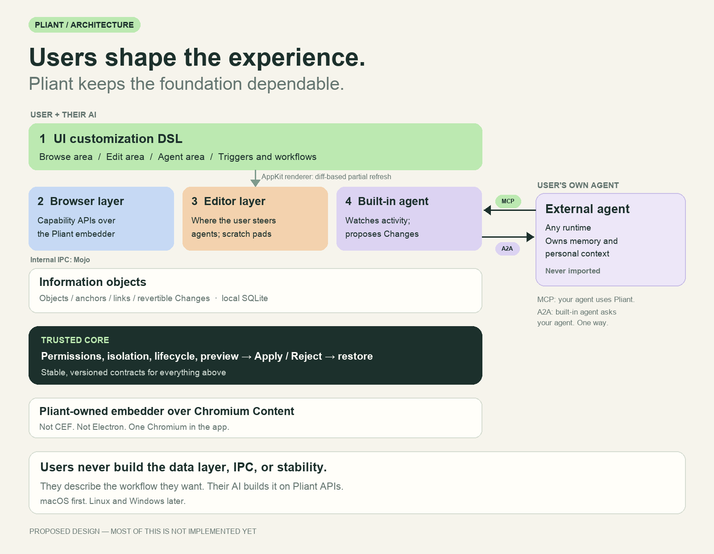

# Pliant

**Browse, edit, and work with your agent in one application.**

[Four modules](docs/design/modules-vision.md) · [Design philosophy](DESIGN_PHILOSOPHY.md) · [Decisions](docs/decisions/0002-editor-browser-agent-scope.md) · [Implementation plan](IMPLEMENTATION_PLAN.md) · [Module map](MODULES.md) · [Discuss an idea](https://github.com/yifanswe/pliant-workbench/issues)

## Why

Browsing and editing are the two main things people do with information. Today they happen in different applications: a browser to read, an editor to write, a terminal to run, Slack or Zoom to talk to people, and a chat window to talk to an agent. Users copy content between them all day.

Pliant puts all three in one application, and it is a new kind of application. You select a paragraph on a page, and it opens in a scratch pad next to the page. You keep typing; you do not @mention anyone or press a button. Your agent watches the scratch pad and helps. It fills a link you forgot, answers a question, or proposes a change. Nothing changes until you apply it.

Everyone works differently, so Pliant does not ship one fixed workflow. You tell your AI the workflow you want, and it builds that workflow on Pliant APIs. Pliant provides the data layer, the process communication, and the stability. One person's needs grow inside one application.

## How it fits together

| Module | What it does |
| --- | --- |
| 1. UI customization (DSL) | One definition language for the browse area, the edit area, the agent area, and the triggers between them. AppKit renders it and refreshes only what changed. |
| 2. Browser layer | Browser capabilities in the Pliant-owned embedder over Chromium Content, exposed as Pliant APIs. Slack, Zoom and other communication tools run here as web apps. |
| 3. Editor layer | The main place where you steer agents. Scratch pads and a terminal are shared by you and the agent. |
| 4. Agent layer | A built-in agent inside Pliant. Your own agent uses Pliant through MCP. The built-in agent asks your agent for memory through A2A, one way. Your agent's memory is never imported. |

All four modules share one [information-object model](docs/design/information-objects.md): pages, files, notes, and agent results are objects with anchors, links, and revertible changes. See the [module vision](docs/design/modules-vision.md) for the full design.

## Status

Pliant is early. Most of the design above is **not implemented yet**.

**Done:** a macOS arm64 vertical slice. It has a Pliant-owned Chromium Content embedder, its Rust host API, an API test app, a JSON UI-definition crate with two definitions, and a native demo browser. The demo lets a user change the browser layout with preview → Apply / Reject → restore.

**Not done:** the editor, the agents, MCP and A2A, the information-object model, the general DSL, plugins, Linux, and Windows.

**Next milestone:** a minimal browse + edit loop. Select text on a page, send it to a note, then jump from the note back to the highlighted text.

## Key decisions

| Topic | Decision |
| --- | --- |
| Engine | Pliant-owned embedder over Chromium Content. Not CEF, not Electron. |
| Shell UI | AppKit plus Pliant's own DSL. No SwiftUI and no other UI engine. |
| Editor | Version 1 reuses the VS Code core. Later: Pliant's own editor, compatible with VS Code. No VS Code extensions in version 1. |
| Agents | Built-in agent on internal Mojo IPC. Your agent → Pliant through MCP. Built-in agent → your agent through A2A, one way. MCP first. |
| Data | Local SQLite database. Files on disk stay the source of truth. |
| Platform | macOS first. Linux and Windows later. |
| Size | About 0.8–1.2 GB is acceptable. |
| License | Apache-2.0. |

Open questions are listed only in [ADR 0002](docs/decisions/0002-editor-browser-agent-scope.md#open-questions).

## Safety

Users change a lot in Pliant, so the core keeps firm limits. Every change, by the user or by an agent, goes through preview → Apply / Reject → restore. Agents propose changes; the user applies them. Pliant does not support Chrome or Firefox extensions; customization goes through its own DSL and APIs.

## Build

Chromium build steps are in [embedder/chromium/BUILDING.md](embedder/chromium/BUILDING.md). The demo browser is described in [apps/browser/README.md](apps/browser/README.md).

---

Concept by [Yifan Li](https://github.com/yifanswe). Licensed under [Apache-2.0](LICENSE). Images are concept illustrations rendered by [`tools/render_assets.py`](tools/render_assets.py), not product screenshots.
