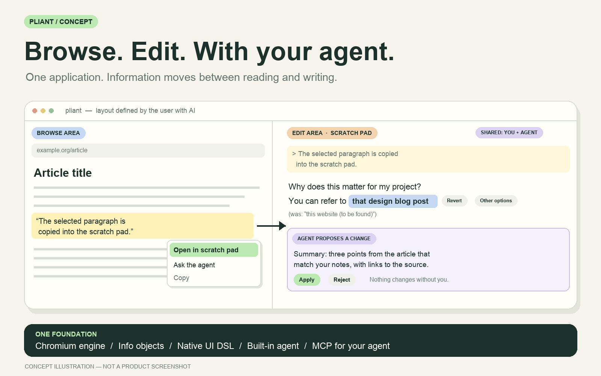

# Pliant

**An editor, a browser, and an agent in one application.**

[Design philosophy](DESIGN_PHILOSOPHY.md) · [Four modules](docs/design/modules-vision.md) · [Implementation plan](IMPLEMENTATION_PLAN.md) · [Module map](MODULES.md) · [Discuss an idea](https://github.com/yifanswe/pliant-browser/issues)

Pliant is a new kind of application. Browsing and editing are the two most important things people do with information. Today they live in separate applications, and agent chat lives in a third. In Pliant, AI agents give unlimited malleability between browsing and editing the same information. One person's needs grow inside one application, without switches between applications. See [ADR 0002](docs/decisions/0002-editor-browser-agent-scope.md).

Pliant is designed for user customization from the start. A user tells an AI the workflow they want. The AI builds it on Pliant APIs. The user never builds the data layer, inter-process communication, or stability.

## Four modules

The [module vision](docs/design/modules-vision.md) is the source of truth. In short:

1. **UI customization (DSL).** One definition language for the browse area, the edit area, and the agent area. Reference example: select web text, right-click, and an agent area or scratch pad opens with the text copied.
2. **Browser layer.** Browser capabilities implemented in the Pliant-owned embedder over Chromium Content ([ADR 0001](docs/decisions/0001-own-chromium-embedding.md)) and exposed as Pliant APIs.
3. **Editor layer.** The main place where the user steers agents. The agent watches user activity and a co-owned scratch pad, and helps without a chat prompt.
4. **Agent layer.** A built-in agent, internal only (Mojo IPC). Pliant exposes its capabilities to the user's external agent through MCP. The built-in agent asks the external agent for memory through A2A, one way. MCP ships first; A2A follows.

## Status

Implemented: a macOS arm64 vertical slice. It contains a Pliant-owned Chromium Content embedder, its Rust trusted-host API, an independent API test app, a bounded JSON UI-definition crate, two distinct definitions, and a native customization-demo browser with preview, Apply, Reject, and restore. Chromium source, dependencies, and build outputs stay in a separately provisioned workspace at the pinned revision.

Not implemented: the editor, the agents, MCP/A2A, the information-object model, the general DSL, plugins, Linux, and Windows. See the [module map](MODULES.md).

**Next milestone:** a minimal browse + edit loop.

## Key decisions

| Topic | Decision |
| --- | --- |
| Engine | Pliant-owned embedder over Chromium Content. Not CEF or Electron. |
| Shell UI | AppKit plus own DSL; no SwiftUI. No Electron or other extra UI engine. The DSL layer translates definitions to native views with diff-based partial refresh. |
| Editor | Version 1 reuses the VS Code core. Long term: an own editor with VS Code compatibility. VS Code extensions are out of scope for version 1. |
| Agents | Built-in agent (internal, Mojo). External agent → Pliant through MCP. Built-in → external agent through A2A, one way. The built-in agent works without an external agent. |
| Data | Local SQLite database. Files on disk remain the source of truth. |
| Platform | macOS first. Linux and Windows later. Mobile deferred. |
| Size | About 0.8–1.2 GB is acceptable. |
| License | Apache-2.0. |

Open questions: editor version 1 hosting; owner review of the [information-object draft](docs/design/information-objects.md). The [ADR 0002](docs/decisions/0002-editor-browser-agent-scope.md) list is authoritative.

## Customization with safety guards

There is no Chrome/Firefox extension compatibility, by design. Users customize Pliant through its own DSL, APIs, and plugins, directly or with an AI. Personal choices do not need an upstream pull request.

The core enforces safety boundaries while users change their experience. Every change goes through preview → Apply/Reject → restore. Infrastructure upgrades remain possible with or without AI.

---

Concept by [Yifan Li](https://github.com/yifanswe). Licensed under [Apache-2.0](LICENSE).
