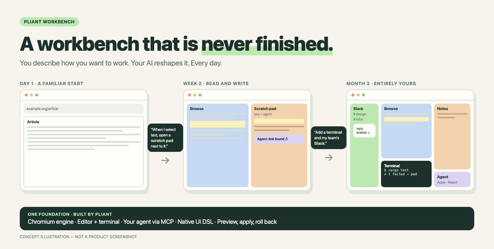

# Pliant Workbench

### Don't adapt to your tools. Grow your own.

Pliant workbench is not a workbench. It is the infrastructure to **build your own** and keep changing it.

## The idea

Every app ships a fixed idea of how you should work. A browser to read. An editor to write. A terminal to run. Slack and Zoom to talk. A chat box for AI. Optimizing the workflow between them is hard.

Pliant flips this. Your workbench is **never finished**. You describe the workflow you want, your AI builds it on Pliant, and you reshape it tomorrow.

> *"When I select text on a page, open a scratch pad next to it. Let my agent watch it and help while I type."*
>
> That's not a feature we ship. It's a workbench you build in one sentence.

## What Pliant gives you

| | |
| --- | --- |
| **Browse** | A real Chromium engine. Web apps like Slack and Zoom included. |
| **Edit and run** | An editor and a terminal, shared with your agent. |
| **Your agent, at home** | Bring the agent you already have, with its memory. It uses Pliant through MCP. |
| **A UI you define** | A native AppKit DSL. Every panel, trigger and flow is yours. |
| **Safe to change** | Every change previews first. Apply, reject or roll back. Nothing breaks for good. |

You and your AI decide what the workbench is. Pliant handles the hard parts: data, processes and stability.

## Status

Early. A macOS demo is working: a Pliant-owned Chromium embedder and a browser whose layout users redefine with preview → Apply / Reject → restore.

**Next:** a browse + edit loop. Send text from a page to a note, then jump back to the source.

Editor, terminal, agents and the full DSL are designed, not built. → [Design](docs/design/modules-vision.md) · [Decisions](docs/decisions/0002-editor-browser-agent-scope.md) · [Architecture](DESIGN_PHILOSOPHY.md) · [Build](embedder/chromium/BUILDING.md)

---

macOS first · Apache-2.0 · by [Yifan Li](https://github.com/yifanswe) · [Share an idea](https://github.com/yifanswe/pliant-workbench/issues)
